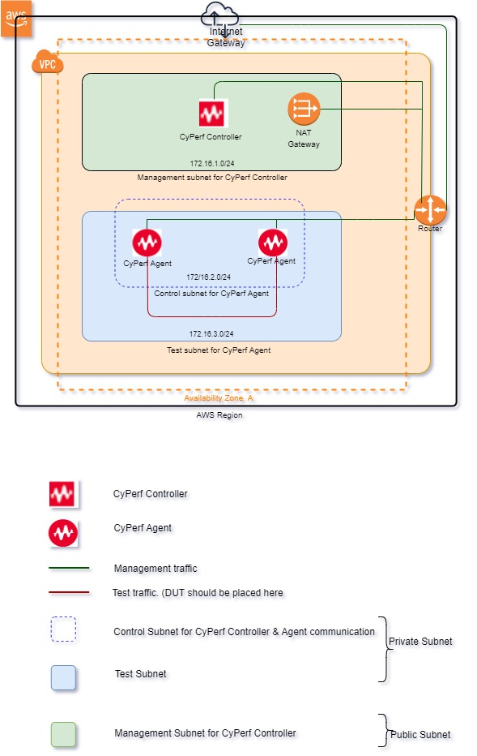

# Deploying the CyPerf in AWS for Controller and Agent Pair      
## Introduction
This solution uses a CloudFormation Template to deploy CyPerf Controller and two CyPerf Agents in an Amazon Virtual Private Cloud.
There is a new VPC template, meaning the entire necessary resources will be created from scratch, including VPC, subnets, route table, Internet Gateway, Nat-gateway etc. 
Existing VPC template, meaning entire network resources like VPC, subnets, route tables, IGW, Nat-Gateway including Security group are pre-exists. User will be able to select existing VPC, subnet and security group during deployment.
See the Template Parameters Section for more details. Each agent has two interfaces. One is Management interface and other is Test interface. Agent communicate with Controller using Management interface. CyPerf test traffic flows through Test interface.  In this deployment first or default interface of Agent is set as test interface and second interface is set as management interface. So, in this deployment test traffic get exchanges between first interface of both the agents.

## Topology Diagram

## Template Parameters

The following table lists the parameters for this deployment in **New VPC**.

| **Parameter label (name)**                  | **Default**            | **Description**  |
| ----------------------- | ----------------- | ----- |
| Stack name            | Requires input   | Specify the deployment stack name. Please select the stack name as per the following specifications: https://docs.aws.amazon.com/AWSCloudFormation/latest/UserGuide/cfn-using-console-create-stack-parameters.html. The stack name can contain a maximum of 9 alphanumeric characters. Amazon imposes this character length limit because the name of other resources from this stack starts with the stack name, and the maximum resource name length is 64 characters. If you are deploying the Quick Start multiple times in the same environment, make sure to use a unique name. |
| Username      | Requires input       | Email ID of the stack owner. All resources created by this stack are tagged with Username. |
| Project | Requires input | The name of the project where this stack will be used. |
| Availability Zones | Requires input | Availability Zone to use for the subnets in the VPC. Select Availability Zone from the drop-down list. |
| VPC | 172.16.0.0/16 |The CIDR block for the VPC. |
| Management Subnet for CyPerf Controller | 172.16.1.0/24 | This subnet is attached to CyPerf Controller and would be used to access the CyPerf Controllers' UI. |
| Instance Type for CyPerf Agents | c4.2xlarge | The EC2 instance type to use for the Keysight CyPerf Agent instances. For a compute-based instance, it is recommended to use at least c4.2xlarge instance type. |
| SSH Key                   | Requires input            | Name of an existing EC2 KeyPair to enable SSH access to the CyPerf instances.  |
| Control Subnet for CyPerf Agents                   | 172.16.2.0/24            | CyPerf agents will use this subnet for control plane communication with Controller.  |
| Test Subnet for CyPerf Agents                   | 172.16.3.0/24            | CyPerf agents will use this subnet for test traffic.  |
| Allowed Subnet for Security Group                   | 1.1.1.1/1            | Subnet range allowed to access deployed AWS resources. Execute `curl ifconfig.co` to know MyIP or google for “what is my IP”. Default value is dummy value. User must use proper subnet range.   |

The following table lists the parameters for this deployment in **Existing VPC**.

| **Parameter label (name)**                   | **Default**            | **Description**  |
| ----------------------- | ----------------- | ----- |
| Stack name            | Requires input   | Specify the deployment stack name. Please select the stack name as per the following specifications: https://docs.aws.amazon.com/AWSCloudFormation/latest/UserGuide/cfn-using-console-create-stack-parameters.html. The stack name can contain a maximum of 9 alphanumeric characters. Amazon imposes this character length limit because the name of other resources from this stack starts with the stack name, and the maximum resource name length is 64 characters. If you are deploying the Quick Start multiple times in the same environment, make sure to use a unique name. |
| Username      | Requires input       | Email ID of the stack owner. All resources created by this stack are tagged with Username. |
| Project | Requires input | The name of the project where this stack will be used. |
| Availability Zones | Requires input | Availability Zone to use for the subnets in the VPC. Select Availability Zone from the drop-down list. |
| VPC | 172.16.0.0/16 |The CIDR block for the VPC. |
| Management Subnet for CyPerf Controller | Select subnet from drop down | Preferred Existing Management subnet for CyPerf Controller. This subnet is attached to CyPerf Controller and would be used to access the CyPerf Controllers' UI. |
| Security Group of CyPerf Controller                   | Select security group from drop down            | Preferred Existing Security group of CyPerf Controller.  |
| Instance Type for CyPerf Agents | c4.2xlarge | The EC2 instance type to use for the Keysight CyPerf Agent instances. For a compute-based instance, it is recommended to use at least c4.2xlarge instance type. |
| SSH Key                   | Requires input            | Name of an existing EC2 KeyPair to enable SSH access to the CyPerf instances.  |
| Control Subnet for CyPerf Agents                   | Select subnet from drop down            | Preferred Existing Control subnet for CyPerf Agent.  |
| Test Subnet for CyPerf Agents                   | Select subnet from drop down            | Preferred Existing Test subnet for CyPerf Agent.  |
| Security Group of CyPerf Agent                   | Select security group from drop down            | Preferred Existing Security group of CyPerf Agent.   |

