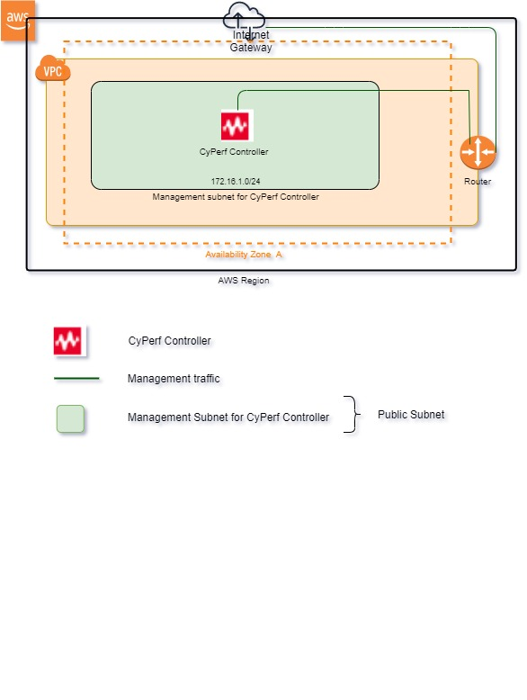

# Deploying the CyPerf in AWS for controller only      
## Introduction
This solution uses a CloudFormation Template to deploy CyPerf Controller in an Amazon Virtual Private Cloud.
There is a new VPC template, meaning the entire necessary resources will be created from scratch, including VPC, subnets, route table, Internet Gateway, Nat-gateway etc. 
Existing VPC template, meaning entire network resources like VPC, subnets, route tables, IGW including Security group are pre-exists. User will be able to select existing VPC, subnet and security group during deployment.
see the Template Parameters Section for more details. 

## Topology Diagram

## Template Parameters
The following table lists the parameters for this deployment in **New VPC**.

| **Parameter label (name)**                   | **Default**            | **Description**  |
| ----------------------- | ----------------- | ----- |
| Stack name            | Requires input   | Specify the deployment stack name. Please select the stack name as per the following specifications: https://docs.aws.amazon.com/AWSCloudFormation/latest/UserGuide/cfn-using-console-create-stack-parameters.html. The stack name can contain a maximum of 9 alphanumeric characters. Amazon imposes this character length limit because the name of other resources from this stack starts with the stack name, and the maximum resource name length is 64 characters. If you are deploying the Quick Start multiple times in the same environment, make sure to use a unique name. |
| Username      | Requires input       | Email ID of the stack owner. All resources created by this stack are tagged with Username. |
| Project | Requires input | The name of the project where this stack will be used. |
| VPC | 172.16.0.0/16 |The CIDR block for the VPC. |
| Availability Zones | Requires input | Availability Zone to use for the subnets in the VPC. Select Availability Zone from the drop-down list. |
| Management Subnet for CyPerf Controller | 172.16.1.0/24 | This subnet is attached to CyPerf controller and would be used to access the CyPerf controllers' UI. |
| SSH Key                   | Requires input            | Name of an existing EC2 KeyPair to enable SSH access to the CyPerf Controller.  |
| Allowed Subnet for Security Group      | 1.1.1.1/1      | Subnet range allowed to access deployed AWS resources. Execute `curl ifconfig.co` to know MyIP or google for “what is my IP”. Default value is dummy value. User must use proper subnet range.  |

The following table lists the parameters for this deployment in **Existing VPC**.

| **Parameter label (name)**                   | **Default**            | **Description**  |
| ----------------------- | ----------------- | ----- |
| Stack name      | Requires input     | Specify the deployment stack name. Please select the stack name as per the following specifications: https://docs.aws.amazon.com/AWSCloudFormation/latest/UserGuide/cfn-using-console-create-stack-parameters.html. The stack name can contain a maximum of 9 alphanumeric characters. Amazon imposes this character length limit because the name of other resources from this stack starts with the stack name, and the maximum resource name length is 64 characters. If you are deploying the Quick Start multiple times in the same environment, make sure to use a unique name.  |
| Username                  | Requires input            | Email ID of the stack owner. All resources created by this stack are tagged with Username.  | 
| Project                  | Requires input            | The name of the project where this stack will be used.  | 
| Availability Zones                  | Requires input            | Availability Zone to use for the subnets in the VPC. Select Availability Zone from the drop-down list.  | 
| VPC                  | Requires input          | Preferred Existing VPC.  | 
| Management Subnet for CyPerf Controller                  | Select subnet from drop down            | Preferred Existing Management subnet for CyPerf Controller. This subnet is attached to CyPerf controller and would be used to access the CyPerf controllers' UI.  |
| SSH Key                   | Requires input            | Name of an existing EC2 KeyPair to enable SSH access to the CyPerf Controller.  | 
| Security Group of CyPerf Controller                  | 1.1.1.1/1            | Subnet range allowed to access deployed AWS resources. Execute `curl ifconfig.co` to know MyIP or google for “what is my IP”.  |

## Post deployment

After successful deployment of stack, flow bellow instructions

-	Go to EC2 Dashboard and look for the deployed instance
-	Select the Controller instance and check the public IP 
-	Open your browser and access CyPerf Controller UI with URL https://"Controller Public IP" (Default Username/Password: admin/CyPerf&\Keysight#1)
-   Registered CyPerf agents should appear in Controller UI automatically.
-   CyPerf license needs to be procured for further usage. These licenses need to be configured at “Administration” followed by “License Manager” on CyPerf controller gear menu.