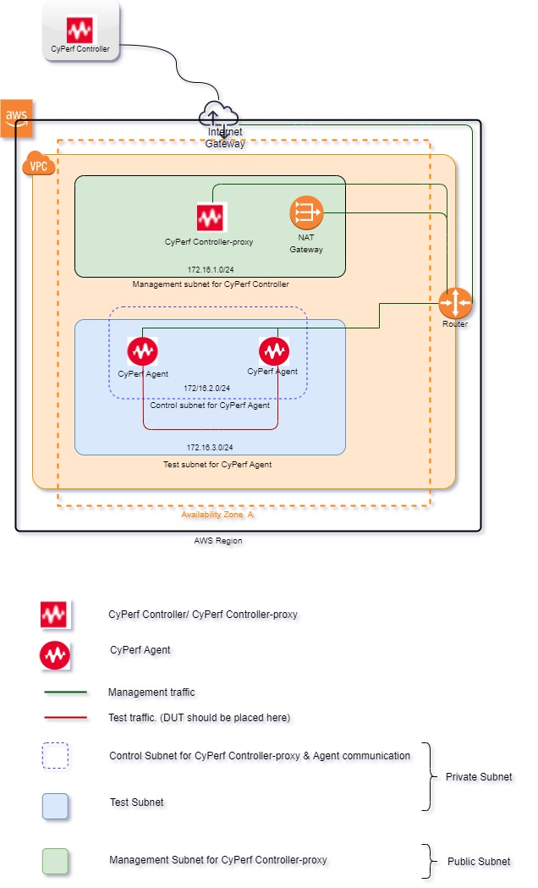

# Deploying CyPerf in AWS using the Controller Proxy and Agent Pair 
## Introduction
This solution uses a CloudFormation Template to deploy the CyPerf Controller-proxy and two CyPerf Agents in an Amazon Virtual Private Cloud solution.
You can use templates in two ways:
- Using a new VPC template, meaning the entire necessary resources are created from scratch, including VPC, Subnets, Route Table, Internet Gateway, Nat-Gateway and so on.
- Or use an existing VPC template, meaning entire network resources like VPC, Subnets, Route Tables, IGW, Nat-Gateway including Security Groups already exists. You can select an existing VPC, subnet and security group during deployment.

See the **Template Parameters** topic for more details. 

Each agent has two interfaces:
- The Management interface, agents communicate with the Controller-Proxy using this interface
- The Test interface, test traffic flows through it.

During the first deployment, a default Agent is set as the test interface and the management interface is set as the second interface. This means that the deployment test traffic flows only between the first interface of both agents.

## Topology Diagram

## Template Parameters
The following table lists the parameters for the deployment in a **New VPC**.

|**Parameter label (name)**                   |**Default**       |**Description**                                                                                                                                                                                                      |
|---------------------------------------------|--------------|--------------------------------------------------------------------------------------------------------------------------------------------------------------------------------------------------------------------|
|Stack Name                                   |Requires Input|Specify the deployment stack name. Please select the stack name as per the following specifications: [https://docs.aws.amazon.com/AWSCloudFormation/latest/UserGuide/cfn-using-console-create-stack-parameters.html](https://docs.aws.amazon.com/AWSCloudFormation/latest/UserGuide/cfn-using-console-create-stack-parameters.html). The stack name can contain a maximum of 9 alphanumeric characters. Amazon imposes this character length limit because the name of other resources from this stack starts with the stack name, and the maximum resource name length is 64 characters. If you are deploying the Quick Start multiple times in the same environment, make sure to use a unique name.|
|Username                                     |Requires Input|Email ID of the stack owner. All resources created by this stack are tagged with Username.                                                                                                                           |
|Project                                      |Requires Input|The name of the project where this stack is used.                                                                                                                                                                    |
|Availability Zones                           |Requires Input|Availability Zone is used for the subnets in the VPC. Select the Availability Zone from the drop-down list.                                                                                                          |
|VPC                                          |172.16.0.0/16 |The CIDR block for the VPC.                                                                                                                                                                                          |
|Management Subnet for CyPerf Controller Proxy|172.16.1.0/24 |This subnet is attached to CyPerf controller-proxy.                                                                                                                                                                  |
|Instance Type for CyPerf Agents              |c4.2xlarge    |The EC2 instance type to use for the Keysight CyPerf Agent instances.                                                      |
|SSH Key                                      |Requires input|The name of an existing EC2 KeyPair to enable SSH access to the CyPerf instances.                                                                                                                                     |
|Control Subnet for CyPerf Agents             |172.16.2.0/24 |CyPerf agents use this subnet for control plane communication with a  controller.                                                                                                                                     |
|Test Subnet for CyPerf Agents                |172.16.3.0/24 |CyPerf agents use this subnet for test traffic.                                                                                                                                                                       |
|Allowed Subnet for Security Group            |1.1.1.1/1     |Subnet range allowed to access deployed Controller Proxy. Execute `curl ifconfig.co` to know MyIP or google for “what is my IP”. The default value is an example value. You must use a proper subnet range.                                           |

The following table lists the parameters for this deployment in **Existing VPC**.

|**Parameter label (name)**                   |**Default**                         |**Description**                                                                                                                                                                                                      |
|---------------------------------------------|------------------------------------|--------------------------------------------------------------------------------------------------------------------------------------------------------------------------------------------------------------------|
|Stack name                                   |Requires input                      |Specify the deployment stack name. Please select the stack name as per the following specifications: [https://docs.aws.amazon.com/AWSCloudFormation/latest/UserGuide/cfn-using-console-create-stack-parameters.html](https://docs.aws.amazon.com/AWSCloudFormation/latest/UserGuide/cfn-using-console-create-stack-parameters.html). The stack name can contain a maximum of 9 alphanumeric characters. Amazon imposes this character length limit because the name of other resources from this stack starts with the stack name, and the maximum resource name length is 64 characters. If you are deploying the Quick Start multiple times in the same environment, make sure to use a unique name.|
|Username                                     |Requires input                      |Email ID of the stack owner. All resources created by this stack are tagged with Username.                                                                                                                           |
|Project                                      |Requires input                      |The name of the project where this stack is used.                                                                                                                                                                    |
|Availability Zones                           |Requires input                      |Availability Zone to use for the subnets in the VPC. Select Availability Zone from the drop-down list.                                                                                                               |
|VPC                                          |172.16.0.0/16                       |The CIDR block for the VPC.                                                                                                                                                                                          |
|Management Subnet for CyPerf Controller Proxy|Select subnet from drop down        |Preferred Existing Management subnet for CyPerf Controller-proxy. This subnet is attached to CyPerf controller and is used to access the CyPerf controllers' UI.                                                      |
|Security Group of CyPerf Controller Proxy    |Select security group from drop down|Preferred Existing Security group of CyPerf Controller-proxy.                                                                                                                                                         |
|Instance Type for CyPerf Agents              |c4.2xlarge                          |The EC2 instance type to use for the Keysight CyPerf Agent instances.                                                  |
|SSH Key                                      |Requires Input                      |Name of an existing EC2 KeyPair to enable SSH access to the CyPerf instances.                                                                                                                                         |
|Control Subnet for CyPerf Agents             |Select subnet from drop down      |Preferred Existing Control subnet for CyPerf Agent.                                                                                                                                                                   |
|Test Subnet for CyPerf Agents                |Select subnet from drop down        |Preferred Existing Test subnet for CyPerf Agent.                                                                                                                                                                      |
|Security Group of CyPerf Agent               |Select security group from drop down|Preferred Existing Security group of CyPerf Agent.                                                                                                                                                                    |

## Post deployment

After successful deployment of stack, flow bellow instructions

-	Go to EC2 Dashboard and look for the deployed instance
-	Select the Controller Proxy instance and check the public IP 
-	Open your browser and access pre existing CyPerf Controller UI with URL https://"Controller Public IP" (Default Username/Password: admin/CyPerf\&Keysight#1)
-   Select the gear icon in the right top corner. Select “Administration”, followed by Controller Proxies. 
    If Controller and Controller Proxy are in same vpc, add the Controller Proxy private IP.
    Else, add Controller Proxy Public IP. Allow Controller Public IP at Controller proxy's inbound Security rule for port 443.
-   Registered CyPerf agents should appear in Controller UI automatically.
-   CyPerf license needs to be procured for further usage. These licenses need to be configured at “Administration” followed by “License Manager” on CyPerf controller gear menu.

