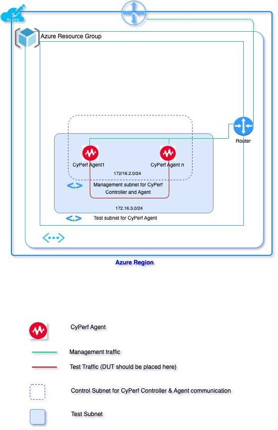

# Deploying the CyPerf in Azure for agent only     
## Introduction
This solution uses an ARM Template to deploy CyPerf Agent only at Azure Cloud.
There is a new VNET template, meaning the entire necessary resources will be created from scratch, including VNET, subnets, Security group etc. 
Existing VNET template, meaning entire network resources like Resource group, VNET, subnets, Security group are pre-existing. User will be able to select existing VNET, subnet and security group during deployment.
See the Template Parameters Section for more details. Each agent has two interfaces. One is Management interface and other is Test interface. Agent communicate with Controller using Management interface. CyPerf test traffic flows through Test interface.  In this deployment first or default interface of Agent is set as management interface and second interface is set as test interface. 

## Topology Diagram

## Template Parameters
The following table lists the parameters for this deployment in **New VNET**.

| **Parameter label (name)**                   | **Default**            | **Description**  |
| ----------------------- | ----------------- | ----- |
| Subscription                  | Requires input            | Specify the Azure subscription from dropdown list.  |
| Resource group                   | Requires input            | Either select an existing Resource group from dropdown or create a new resource group with **Create new** option.  |
| Location                   | (US) Central US            | Preferred deployment location from dropdown list.  |
| Deployment Name                   | Requires input            | Preferred prefix for naming resources.  |
| Proximity Placement Group                   | No            | Preferred choice of proximity.  |
| Virtual Network                   | 172.16.0.0/16            | CIDR range for the Virtual Network.  |
| Management Subnet for CyPerf Agent                   | 172.16.2.0/16            | This subnet is attached to CyPerf Agent and would be used to access the CyPerf controllers' UI & CyPerf agents will use this subnet for control plane communication with controller.
| Test Subnet for CyPerf Agents                   | 172.16.3.0/24            | CyPerf agents will use this subnet for test traffic.  |
| CyPerf Version                   | 0.7.0            | CyPerf release version. |
| CyPerf Controller IP                  | Requires input            | CyPerf Controller/ Controller Proxy IP for Agent peering. |
| VM Size Type for CyPerf Agents                   | Standard_F4s_v2            | VM type for CyPerf Agent. VM type Standard_F4s_v2 and Standard_F16s_v2 are qualified.  |
| SSH Public Key                   | Requires input            | Public key to enable SSH access to the CyPerf instances. User may create private key & public key using ssh-keygen. Then specify ssh public key here.   |
| Allowed Subnet for Security Group                   | Requires input            | Subnet range allowed to access deployed Azure resources. Execute `curl ifconfig.co` to know MyIP or google for “what is my IP”.  |
| Number of CyPerf Agents                   |   1          | Number of CyPerf agents will be deployed from this template.  |
| Auth Username                                        | `admin`                    | Username for agent to controller authentication.  For controller-proxy default username `admin`      |
| Auth Password                                        | `CyPerf&Keysight#1`        | Password for agent to controller authentication.      |
| Auth Fingerprint                                     |                          | Fingerprint for agent to controller authentication - OPTIONAL  |

The following table lists the parameters for this deployment in **Existing VNET**.

| **Parameter label (name)**                   | **Default**            | **Description**  |
| ----------------------- | ----------------- | ----- |
| Subscription                  | Requires input            | Specify the Azure subscription from dropdown list.  |
| Resource group                  | Requires input            | Either select an existing Resource group from dropdown or create a new resource group with **Create new** option.  |
| Location                   | (US) Central US            | Preferred deployment location from dropdown list.  |
| Deployment Name                   | Requires input            | Preferred prefix for naming resources.  |
| Proximity Placement Group                   | No            | Preferred choice of proximity.  |
| Virtual Network                   | Requires input           | Name of an existing Virtual Network.  |
| Management Subnet for CyPerf Agent                   | Requires input            | Name of existing management subnet. This subnet will use this subnet for control plane communication with controller.  |
| Test Subnet for CyPerf Agents                   | Requires input            | Name of existing Test subnet. CyPerf agents will use this subnet for test traffic.  |
| CyPerf Version                   | 0.7.0            | CyPerf release version. |
| CyPerf Controller IP                  | Requires input            | CyPerf Controller/ Controller Proxy IP for Agent peering. |
| VM Size Type for CyPerf Agents                   | Standard_F4s_v2            | VM type for CyPerf Agent. VM type Standard_F4s_v2 and Standard_F16s_v2 are qualified. |
| SSH Public Key                   | Requires input            | Public key to enable SSH access to the CyPerf instances. User may create private key & public key using ssh-keygen. Then specify ssh public key here.   |
| Number of CyPerf Agents                   | 1            | Number of CyPerf agents will be deployed from this template.  |
| Auth Username                                        | `admin`                    | Username for agent to controller authentication. For controller-proxy default username is also 'admin'   |
| Auth Password                                        | `CyPerf&Keysight#1`        | Password for agent to controller authentication.      |
| Auth Fingerprint                                     |                          | Fingerprint for agent to controller authentication - OPTIONAL  |

**Note:** **CyPerf** and **Cyperf** represents same. ARM templates use **Cyperf**, instead of **CyPerf**. It becomes an Azure limitation which introduces extra space.

## Post deployment

After successful deployment of stack, flow bellow instructions

-	Go to Azure console and look for the deployed VMs
-	Select the Controller instance and check the public IP 
-	Open your browser and access CyPerf Controller UI with URL https://"Controller Public IP" (Default Username/Password: `admin`/`CyPerf&Keysight#1`)
-   Registered CyPerf agents should appear in Controller UI automatically.
-   CyPerf license needs to be procured for further usage. These licenses need to be configured at “Administration” followed by “License Manager” on CyPerf controller gear menu.
