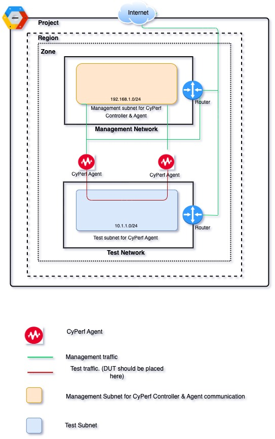

# Deploying the only CyPerf Agent       
## Introduction
This solution uses a Python Template to deploy CyPerf Agents in an GCP Cloud.
There is a new VPC template, meaning the entire necessary resources will be created from scratch, including VPC Network, subnets, Security group etc. 
See the Template Parameters Section for more details. Each agent has two interfaces. One is Management interface and other is Test interface. Agent communicate with Controller using Management interface. CyPerf test traffic flows through Test interface.

## Topology Diagram


## How to Deploy:
A configuration File [YAML] and Templates [Python] are used for this Deployment. However, users can also use standalone Python Templates from the gcloud console for this Deployment.
### Deployment pre-requisites:
1.	Download following files from OpenIxia.
2.	From gcp console, open cloud shell window and upload bellow files. 
- [cyperf_agents_only_new_vpc.py](cyperf_agents_only_new_vpc.py)
- [cyperf_agents_only_new_vpc.py.schema](cyperf_agents_only_new_vpc.py.schema)
- [cyperf_agents_only_new_vpc.yaml](cyperf_agents_only_new_vpc.yaml)  
- [cyperf_agents_only_existing_vpc.py](cyperf_agents_only_existing_vpc.py)
- [cyperf_agents_only_existing_vpc.py.schema](cyperf_agents_only_existing_vpc.py.schema)
- [cyperf_agents_only_existing_vpc.yaml](cyperf_agents_only_existing_vpc.yaml) 

### Deployment using Python Template:
The Deployment Manager requires a Python template and certain parameters to be supplied at command line in the cloud shell.
The list of exposed parameters is defined in the Template parameter section.
### Examples of Deployment using Python Template **New VPC**:
```
<user>@cloudshell:~ (project name)$ gcloud deployment-manager deployments create <deployment name> --template cyperf_agents_only_new_vpc.py --properties zone:us-east1-c,region:us-east1,agentMachineType:c2-standard-4,cyperfVersion:<CyPerf Version>,managementNetworkCIDR:<Subnet>,testNetworkCIDR:<Subnet>,agentCount:1

Example:

$ gcloud deployment-manager deployments create keysight-cyperf-gcp --template cyperf_agents_only_new_vpc.py --properties zone:us-east1-c,region:us-east1,agentMachineType:c2-standard-4,cyperfVersion:2-5,managementNetworkCIDR:172.16.5.0/24,testNetworkCIDR:10.0.0.0/8,agentCount:1
```
### Examples of Deployment using Python Template **Existing VPC**:
```
<user>@cloudshell:~ (project name)$ gcloud deployment-manager deployments create <deployment name> --template cyperf_agents_only_existing_vpc.py --properties zone:us-east1-c,region:us-east1,agentMachineType:c2-standard-4,cyperfVersion:<CyPerf Version>,management_subnet:<Existing subnet from prior mentioned region and zone>,test_subnet:<Existing subnet from prior mentioned region and zone>,agentCount:1

Example:

$ gcloud deployment-manager deployments create keysight-cyperf-gcp-ext2 --template cyperf_agents_only_existing_vpc.py --properties zone:us-east1-c,region:us-east1,agentMachineType:c2-standard-4,cyperfVersion:2-5,agentCount:1,management_subnetwork:"keysight-cyperf-gcp1-cyperf-management-subnetwork",test_subnetwork:"keysight-cyperf-gcp1-cyperf-test-subnetwork"
```

### Example of Deployment using a YAML file **New VPC**:
```
<user>@cloudshell:~ (project name)$ gcloud deployment-manager deployments create <deployment name> --config cyperf_agents_only_new_vpc.yaml
```

### Example of Deployment using a YAML file **Existing VPC**:
```
<user>@cloudshell:~ (project name)$ gcloud deployment-manager deployments create <deployment name> --config cyperf_agents_only_existing_vpc.yaml
```
### SSH Key:
To generate the public key and enable SSH access to the CyPerf instances, perform the following steps:

1. Create private key and public key, see [Creating a new SSH key](https://cloud.google.com/compute/docs/instances/adding-removing-ssh-keys#createsshkeys).
2. For New VPC Edit [cyperf_controller_and_agent_pair_new_vpc.py](cyperf_controller_and_agent_pair_new_vpc.py), and specify 
`sslkey ='<Replace with ssh public key.>'`.
3. For Existing VPC Edit [cyperf_controller_and_agent_pair_existing_vpc.py](cyperf_controller_and_agent_pair_existing_vpc.py), and specify 
`sslkey ='<Replace with ssh public key.>'`.

## Template Parameters:
The following table lists the parameters for this deployment in **New VPC**.

| Parameter label (name)                   | Default            | Description  |
| ----------------------- | ----------------- | ----- |
| zone                   | Requires input            | Preferred Zone name for the deployment.  |
| region                   | Requires input            | Preferred Region name for the deployment.  |
| agentMachineType                   | c2-standard-4            | Preferred machine Type for CyPerf Agent.  |
| cyperfVersion                   | 2-5            | Preferred CyPerf Release version. Options are 2-5, 2-1, 2-0 |
| managementNetworkCIDR                   | Requires input. Example: 172.16.5.0/24 | This subnet is attached to CyPerf controller and would be used to access the CyPerf controllers' UI & CyPerf agents will use this subnet for control plane communication with controller.  |
| testNetworkCIDR                   | Requires input. Example: 10.0.0.0/8            | CyPerf agents will use this subnet for test traffic.  |
| agentCount                  | 1            | Number of CyPerf agents will be deployed from this template.  |
| serviceAccountEmail         | Requires input       | service accont with 'compute admin' and 'compute network admin' role must be pre exists. Update serviceAccoutEmail value in cyperf_agents_only_new_vpc.py.schema file. Donot use serviceAccountEmail as commandline Parameter. |

## Template Parameters:
The following table lists the parameters for this deployment in **Existing VPC**.

| Parameter label (name)                   | Default            | Description  |
| ----------------------- | ----------------- | ----- |
| zone                   | Requires input            | Preferred Zone name for the deployment.  |
| region                   | Requires input            | Preferred Region name for the deployment.  |
| agentMachineType                   | c2-standard-4            | Preferred machine Type for CyPerf Agent.  |
| cyperfVersion                   | 2-5            | Preferred CyPerf Rlease version. Options are 2-5, 2-1, 2-0  |
| management_subnetwork                   | Requires input. Example: "keysight-cyperf-gcp1-cyperf-management-subnetwork" | This subnet is attached to CyPerf controller and would be used to access the CyPerf controllers' UI & CyPerf agents will use this subnet for control plane communication with controller.  |
| test_subnetwork                   | Requires input. Example: "keysight-cyperf-gcp1-cyperf-test-subnetwork"    | CyPerf agents will use this subnet for test traffic.  |
| agentCount                  | 1            | Number of CyPerf agents will be deployed from this template.  |
| serviceAccountEmail         | Requires input       | service accont with 'compute admin' and 'compute network admin' role must be pre exists. Update serviceAccoutEmail value in cyperf_agents_only_new_vpc.py.schema file. Donot use serviceAccountEmail as commandline Parameter. |

## Post deploy

After successful deployment of stack, flow bellow instructions

-	Go to GCP console and look for the deployed VMs
-	Select the Controller instance and check the public IP 
-	Open your browser and access CyPerf Controller UI with URL https://"Controller Public IP" (Default Username/Password: `admin`/`CyPerf&Keysight#1`)
-   Registered CyPerf agents should appear in Controller UI automatically.
-   CyPerf license needs to be procured for further usage. These licenses need to be configured at “Administration” followed by “License Manager” on CyPerf controller gear menu.
