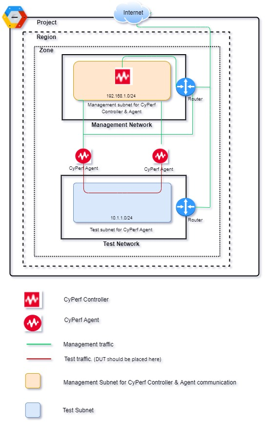

# Deploying the CyPerf in GCP for Controller and Agent Pair       
## Introduction
This solution uses a Python Template to deploy CyPerf Controller and two CyPerf Agents in an GCP Cloud.
There is a new VPC template, meaning the entire necessary resources will be created from scratch, including VPC Network, subnets, Security group etc. 
See the Template Parameters Section for more details. Each agent has two interfaces. One is Management interface and other is Test interface. Agent communicate with Controller using Management interface. CyPerf test traffic flows through Test interface.

## Topology Diagram


## How to Deploy:
A configuration File [YAML] and Templates [Python] are used for this Deployment. However, users can also use standalone Python Templates from the gcloud console for this Deployment.
### Deployment pre-requisites:
1.	Download following files from OpenIxia.
2.	From gcp console, open cloud shell window and upload bellow files. 
- [cyperf_controller_and_agent_pair_new_vpc.py](cyperf_controller_and_agent_pair_new_vpc.py)
- [cyperf_controller_and_agent_pair_new_vpc.schema](cyperf_controller_and_agent_pair_new_vpc.schema)
- [cyperf_controller_and_agent_pair_new_vpc.yaml](cyperf_controller_and_agent_pair_new_vpc.yaml)  

### Deployment using Python Template:
The Deployment Manager requires a Python template and certain parameters to be supplied at command line in the cloud shell.
The list of exposed parameters is defined in the Template parameter section.
### Examples of Deployment using Python Template:
```
<user>@cloudshell:~ (project name)$ gcloud deployment-manager deployments create <deployment name> --template cyperf_controller_and_agent_pair_new_vpc.py --properties zone:us-east1-c,region:us-east1,agentMachineType:e2-standard-4,agentSourceImage:<Agent  Imagename>,managementNetworkCIDR:<Subnet>,testNetworkCIDR:<Subnet>,agentCount:2,controllerSourceImage:<Controller-Image>,controllerMachineType:e2-standard-8
```
### Example of Deployment using a YAML file:
```
<user>@cloudshell:~ (project name)$ gcloud deployment-manager deployments create <deployment name> --config cyperf_controller_and_agent_pair_new_vpc.yaml
```
### SSH Key:
To generate the public key and enable SSH access to the CyPerf instances, perform the following steps:

1. Create private key and public key using [ssh-keygen](https://www.ssh.com/academy/ssh/keygen).
2. Edit [cyperf_controller_and_agent_pair_new_vpc.py](cyperf_controller_and_agent_pair_new_vpc.py), and specify 
`sslkey ='<Replace with ssh public key.>'`.

## Template Parameters:
The following table lists the parameters for this deployment in **New VPC**.

| Parameter label (name)                   | Default            | Description  |
| ----------------------- | ----------------- | ----- |
| zone                   | Requires input            | Preferred Zone name for the deployment.  |
| region                   | Requires input            | Preferred Region name for the deployment.  |
| controllerMachineType                   | e2-standard-8            | Preferred machine Type for CyPerf Controller.  |
| agentMachineType                   | e2-standard-4            | Preferred machine Type for CyPerf Agent.  |
| controllerSourceImage                   | Requires input            | Preferred CyPerf Controller image. Published image will be available at Keysight download page.  |
| agentSourceImage                   | Requires input            | Preferred CyPerf Agent image. Publised image will be available at Keysight download page.  |
| managementNetworkCIDR                   | Requires input. Example: 172.16.5.0/24 | This subnet is attached to CyPerf controller and would be used to access the CyPerf controllers' UI & CyPerf agents will use this subnet for control plane communication with controller.  |
| testNetworkCIDR                   | Requires input. Example: 10.0.0.0/8            | CyPerf agents will use this subnet for test traffic.  |
| agentCount                  | 2            | Number of CyPerf agents will be deployed from this template.  |


## Post deployment

After successful deployment of stack, flow bellow instructions

-	Go to GCP console and look for the deployed VMs
-	Select the Controller instance and check the public IP 
-	Open your browser and access CyPerf Controller UI with URL https://"Controller Public IP" (Default Username/Password: admin/CyPerf&Keysight#1)
-       Registered CyPerf agents should appear in Controller UI autometically.
-       CyPerf license needs to be procured for further usage. These licenses need to be configured at “Administration” followed by “License Manager” on CyPerf controller gear menu.