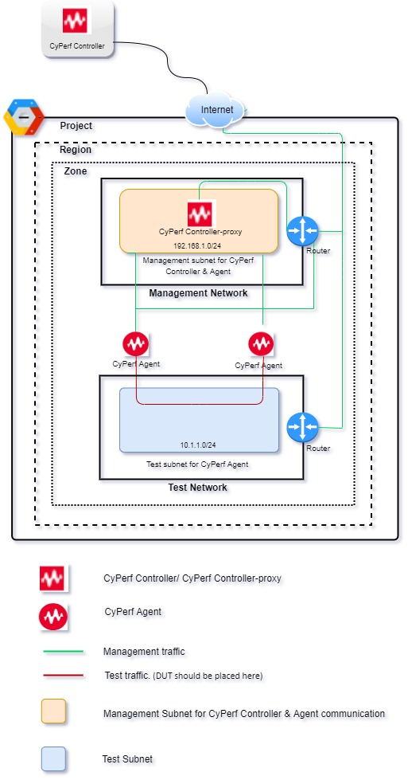

# Deploying the CyPerf in GCP for Controller Proxy and Agent Pair        
## Introduction
This solution uses a Python Template to deploy CyPerf Controller-proxy and two CyPerf Agents in an GCP Cloud.

There is a new VPC template, meaning the entire necessary resources will be created from scratch, including VPC Network, subnets, Security group etc. 

See the Template Parameters Section for more details. Each agent has two interfaces. One is Management interface and other is Test interface. Agent communicate with Controller-proxy using Management interface. CyPerf test traffic flows through Test interface. 

## Topology Diagram:


## How to Deploy:
A configuration File [YAML] and Templates [Python] are used for this Deployment. However, user can also use standalone Python Templates from the gcloud console for this Deployment.
Deployment pre-requisite:
1.	Download following files from OpenIxia.
2.	From gcp console, open cloud shell window and upload bellow files. 
- [cyperf_controller_proxy_and_agent_pair_new_vpc.py](cyperf_controller_proxy_and_agent_pair_new_vpc.py)
- [cyperf_controller_proxy_and_agent_pair_new_vpc.schema](cyperf_controller_proxy_and_agent_pair_new_vpc.py.schema)
- [cyperf_controller_proxy_and_agent_pair_new_vpc.yaml](cyperf_controller_proxy_and_agent_pair_new_vpc.yaml)
- [cyperf_controller_proxy_and_agent_pair_existing_vpc.py](cyperf_controller_proxy_and_agent_pair_existing_vpc.py)
- [cyperf_controller_proxy_and_agent_pair_existing_vpc.schema](cyperf_controller_proxy_and_agent_pair_existing_vpc.py.schema)
- [cyperf_controller_proxy_and_agent_pair_existing_vpc.yaml](cyperf_controller_proxy_and_agent_pair_existing_vpc.yaml)   


### Deployment using Python Template:
The Deployment Manager requires a Python template and certain parameters to be supplied at command line in the cloud shell.

The list of exposed parameters is defined in Template parameter section.

### Examples of Deployment using Python Template **New VPC**:
```

<user>@cloudshell:~ (project name)$ gcloud deployment-manager deployments create <deployment name> --template cyperf_controller_proxy_and_agent_pair_new_vpc.py --properties zone:us-east1-c,region:us-east1,agentMachineType:c2-standard-4,agentSourceImage:<Agent Imagename>,managementNetworkCIDR:<Subnet>,testNetworkCIDR:<Subnet>,agentCount:2, brokerSourceImage:<Controller-Image>,brokerMachineType:e2-medium,authUsername:"admin",authPassword:"CyPerf&Keysight#1"
Example:
$ gcloud deployment-manager deployments create keysight-cyperf-gcp1 --template cyperf_controller_proxy_and_agent_pair_new_vpc.py --properties zone:us-east1-c,region:us-east1,agentMachineType:c2-standard-4,agentSourceImage:keysight-cyperf-agent-3-0,managementNetworkCIDR:172.16.5.0/24,testNetworkCIDR:10.0.0.0/8,agentCount:2,brokerSourceImage:keysight-cyperf-controller-proxy-3-0,brokerMachineType:e2-medium,authUsername:"admin",authPassword:"CyPerf&Keysight#1"
```
### Examples of Deployment using Python Template **Existing VPC**:
```

<user>@cloudshell:~ (project name)$ gcloud deployment-manager deployments create <deployment name> --template cyperf_controller_proxy_and_agent_pair_existing_vpc.py --properties zone:us-east1-c,region:us-east1,agentMachineType:c2-standard-4,agentSourceImage:<Agent Imagename>,management_subnetwork:<Existing subnet from prior mentioned region and zone>,test_subnetwork:<Existing subnet from prior mentioned region and zone>,agentCount:2, brokerSourceImage:<Controller-Image>,brokerMachineType:e2-medium,authUsername:"admin",authPassword:"CyPerf&Keysight#1"

Example: 

$gcloud deployment-manager deployments create keysight-cyperf-gcp-ext1 --template cyperf_controller_proxy_and_agent_pair_existing_vpc.py --properties zone:us-east1-c,region:us-east1,agentMachineType:c2-standard-4,agentSourceImage:keysight-cyperf-agent-3-0,agentCount:2,brokerSourceImage:keysight-cyperf-controller-proxy-3-0,brokerMachineType:e2-medium,management_subnetwork:"keysight-cyperf-gcp1-cyperf-management-subnetwork",test_subnetwork:"keysight-cyperf-gcp1-cyperf-test-subnetwork",authUsername:"admin",authPassword:"CyPerf&Keysight#1"
```

### Example of Deployment using a YAML file **New VPC**:
```
<user>@cloudshell:~ (project name)$ gcloud deployment-manager deployments create <deployment name> --config cyperf_controller_proxy_and_agent_pair_new_vpc.yaml
```
### Example of Deployment using a YAML file **Existing VPC**:
```
<user>@cloudshell:~ (project name)$ gcloud deployment-manager deployments create <deployment name> --config cyperf_controller_proxy_and_agent_pair_existing_vpc.yaml
```

### SSH Key:
To generate the public key and enable SSH access to the CyPerf instances, perform the following steps:

1. Create private key and public key using [ssh-keygen](https://www.ssh.com/academy/ssh/keygen).
2. For New VPC Edit [cyperf_controller_proxy_and_agent_pair_new_vpc.py](cyperf_controller_proxy_and_agent_pair_new_vpc.py), and specify 
`sslkey ='<Replace with ssh public key.>'`.
3. For Existing VPC Edit [cyperf_controller_proxy_and_agent_pair_existing_vpc.py](cyperf_controller_proxy_and_agent_pair_existing_vpc.py), and specify 
`sslkey ='<Replace with ssh public key.>'`.

## Template Parameters:
The following table lists the parameters for this deployment in **New VPC**.

| Parameter label (name)                   | Default            | Description  |
| ----------------------- | ----------------- | ----- |
| zone                   | Requires input            | Preferred Zone name for the deployment.  |
| region                   | Requires input            | Preferred Region name for the deployment.  |
| brokerMachineType                   | e2-medium            | Preferred machine Type for CyPerf Controller-proxy.  |
| agentMachineType                   | c2-standard-4           | Preferred machine Type for CyPerf Agent.  |
| brokerSourceImage                   | keysight-cyperf-controller-proxy-3-0            | Preferred CyPerf Controller-proxy image. |
| agentSourceImage                   | keysight-cyperf-agent-3-0            | Preferred CyPerf Agent image. |
| managementNetworkCIDR                   | Requires input. Example: 172.16.5.0/24 | This subnet is attached to CyPerf controller-proxy & CyPerf agents will use this subnet for control plane communication with controller-proxy.  |
| testNetworkCIDR                   | Requires input. Example: 10.0.0.0/8           | CyPerf agents will use this subnet for test traffic.  |
| agentCount                  | 2            | Number of CyPerf agents will be deployed from this template.  |
| serviceAccountEmail         | Requires input       | service accont with 'compute admin' and 'compute network admin' role must be pre exists. Update serviceAccoutEmail value in the cyperf_controller_proxy_and_agent_pair_new_vpc.py.schema file. Donot use serviceAccountEmail as commandline Parameter.  |
| authUsername                  | admin           | Username for agent to controller authentication.  |
| authPassword                  | CyPerf&Keysight#1            | Password for agent to controller authentication. |

The following table lists the parameters for this deployment in **Existing VPC**.

| Parameter label (name)                   | Default            | Description  |
| ----------------------- | ----------------- | ----- |
| zone                   | Requires input            | Preferred Zone name for the deployment.  |
| region                   | Requires input            | Preferred Region name for the deployment.  |
| brokerMachineType                   | e2-medium            | Preferred machine Type for CyPerf Controller-proxy.  |
| agentMachineType                   | c2-standard-4           | Preferred machine Type for CyPerf Agent.  |
| brokerSourceImage                   | keysight-cyperf-controller-proxy-3-0            | Preferred CyPerf Controller-proxy image. |
| agentSourceImage                   | keysight-cyperf-agent-3-0            | Preferred CyPerf Agent image. |
| management_subnetwork                   | Requires input. Example: "keysight-cyperf-gcp1-cyperf-management-subnetwork" | This subnet is attached to CyPerf controller-proxy & CyPerf agents will use this subnet for control plane communication with controller-proxy.  |
| test_subnetwork                  | Requires input. Example: "keysight-cyperf-gcp1-cyperf-test-subnetwork"           | CyPerf agents will use this subnet for test traffic.  |
| agentCount                  | 2            | Number of CyPerf agents will be deployed from this template.  |
| serviceAccountEmail         | Requires input       | service accont with 'compute admin' and 'compute network admin' role must be pre exists. Update serviceAccoutEmail value in the cyperf_controller_proxy_and_agent_pair_existing_vpc.py.schema file. Donot use serviceAccountEmail as commandline Parameter.  |
| authUsername                  | admin           | Username for agent to controller authentication.  |
| authPassword                  | CyPerf&Keysight#1            | Password for agent to controller authentication. |

## Post deployment

After successful deployment of stack, flow bellow instructions

-	Go to GCP console and look for the deployed VMs
-	Select the Controller Proxy instance and check the public IP 
-	Open your browser and access pre existing CyPerf Controller UI with URL https://"Controller Public IP" (Default Username/Password: `admin`/`CyPerf&Keysight#1`)
-   Select the gear icon in the right top corner. Select “Administration”, followed by “Controller Proxies” and then add the Controller Proxy public IP.
-   Registered CyPerf agents should appear in Controller UI automatically.
-   CyPerf license needs to be procured for further usage. These licenses need to be configured at “Administration” followed by “License Manager” on CyPerf controller gear menu.
